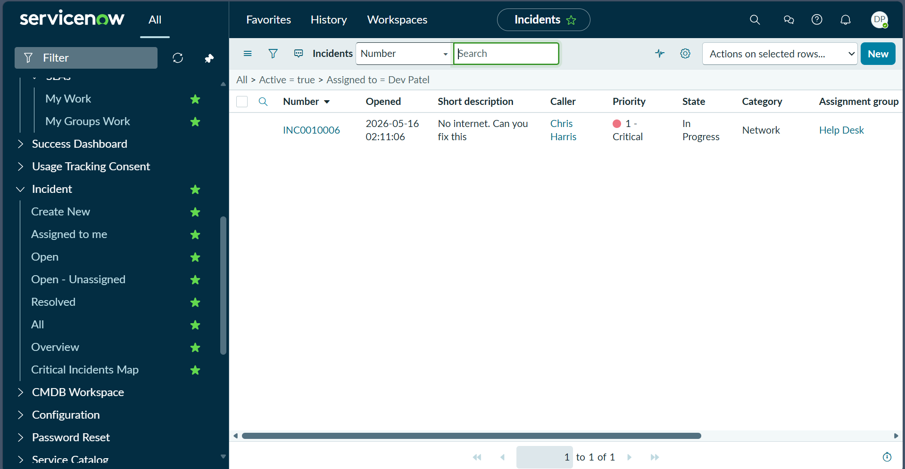
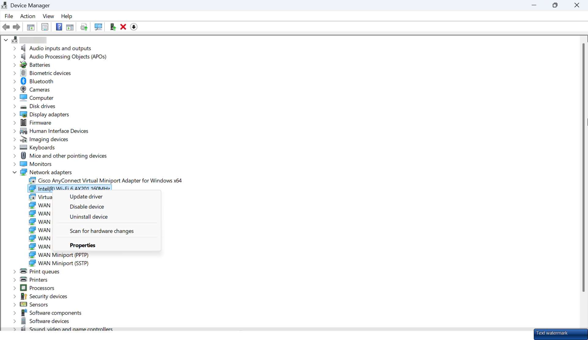
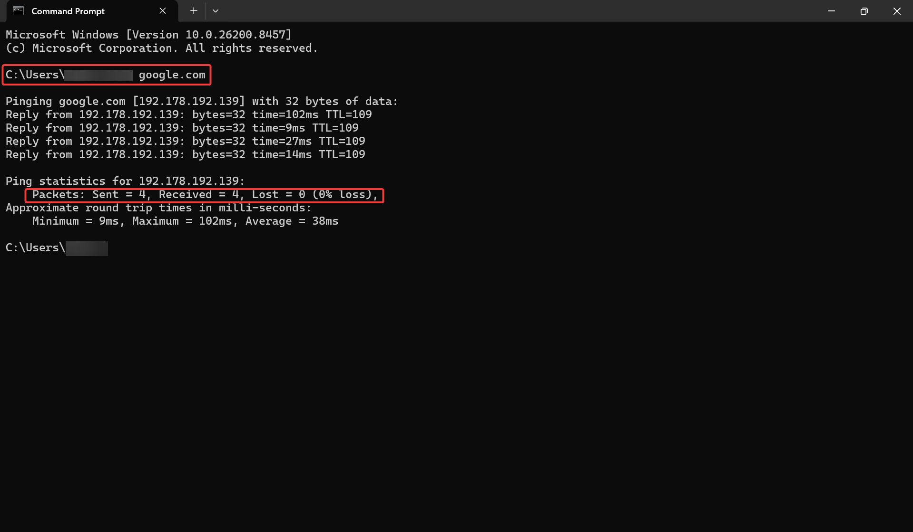
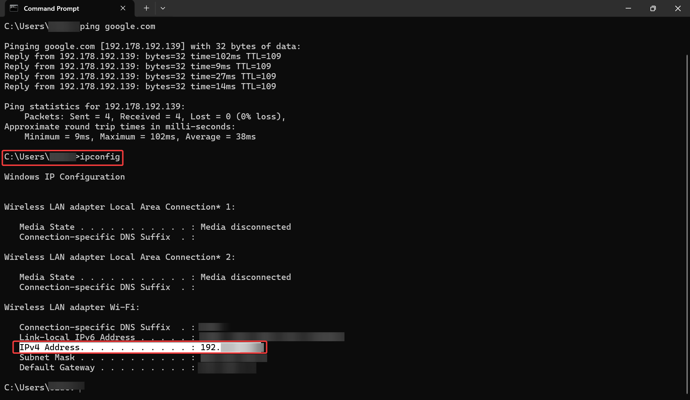
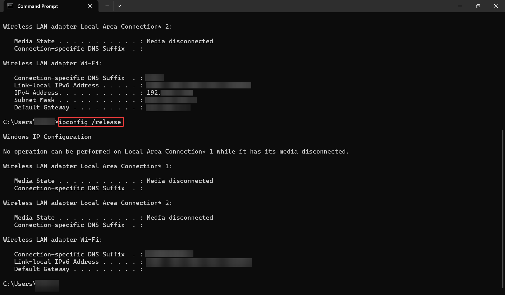
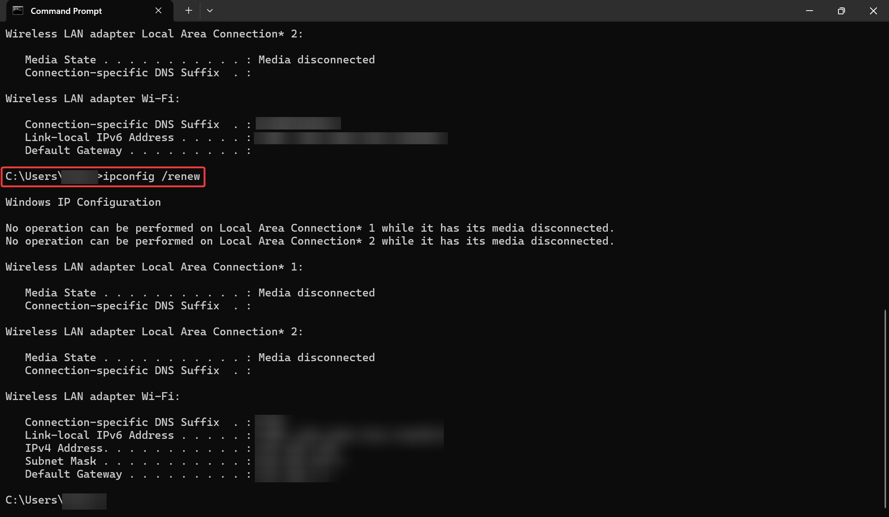
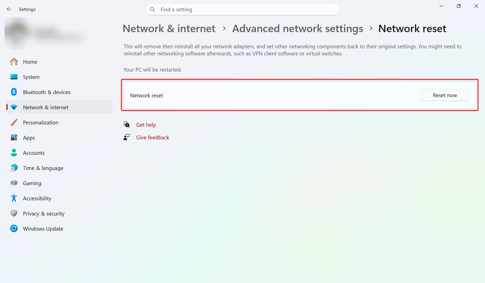
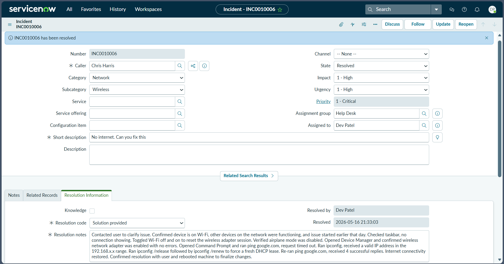
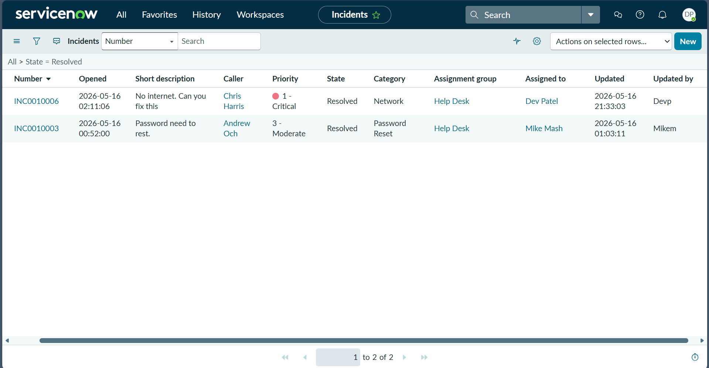

# Network Adapter Driver Corruption

## Incident Information

**Incident Number:** INC0010006  
**Category:** Network Connectivity  
**Priority:** P1 (Critical)  
**Assignment Group:** Help Desk  
**Assigned To:** Dev Patel  
**Caller:** Chris Harris

## Problem Statement

Complete loss of internet connectivity on Windows 11 desktop. All network-dependent applications (browser, email, Teams) failed to load. WiFi icon displayed "Connected" status but no actual internet access available.

## Symptoms

- Browser error: "This site can't be reached"
- Outlook disconnected from Exchange server
- Microsoft Teams status stuck on "Connecting"
- Windows Network Diagnostics reported "Network adapter driver issue"

## Root Cause

Network adapter driver corruption caused by recent Windows Update. Driver version mismatch between OS kernel and network hardware prevented proper adapter initialization.

## Diagnostic Process

1. Verified physical network connection
2. Executed ipconfig /all - confirmed DHCP IP assignment
3. Tested external connectivity via ping to Google DNS - Request timed out
4. Tested internal connectivity via ping to default gateway - Successful
5. Opened Device Manager - identified yellow exclamation mark on network adapter
6. Reviewed driver properties - confirmed incorrect driver version
7. Checked Event Viewer System logs - located driver load failure entries

## Resolution Steps

1. Opened Device Manager
2. Navigated to Network adapters section
3. Right-clicked problematic adapter → selected "Uninstall device"
4. Enabled "Delete the driver software for this device" checkbox
5. Confirmed uninstallation
6. Initiated Windows Network Reset as additional measure
7. System restart triggered automatic driver reinstallation
8. Windows detected hardware and installed correct driver on boot
9. Executed ipconfig /release and /renew to refresh IP assignment
10. Verified connectivity with ping test - successful
11. Tested all affected applications - all functional
12. Documented resolution steps in ServiceNow Work Notes
13. Closed ticket

## Commands Executed

ipconfig /all
ipconfig /release
ipconfig /renew
ping 8.8.8.8
ping google.com

## Screenshots

  
*ServiceNow incidents list showing INC0010006 In Progress - Priority 1 Critical*

  
*Device Manager - Network adapters expanded with right-click menu showing Uninstall device option*

  
*Successful ping to google.com after fix - 0% packet loss, 4 replies received*

  
*ping google.com successful + ipconfig output showing restored network configuration*

  
*ipconfig /release command execution - clearing IP assignment*

  
*ipconfig /renew command execution - obtaining new IP from DHCP*

  
*Windows Settings - Network Reset page (used as additional troubleshooting step)*

  
*ServiceNow incident form INC0010006 showing Resolved state with resolution notes*

  
*ServiceNow incidents list confirming INC0010006 marked Resolved*

## Outcome

**Time to Resolution:** 23 minutes  
**Impact:** Single user  
**Total Downtime:** 23 minutes  
**Follow-up Action:** Created KB article for driver reinstallation procedure

## Technical Skills Demonstrated

- Network troubleshooting methodology
- Windows Device Manager proficiency
- Command-line diagnostic tools (ipconfig, ping)
- Event Viewer log analysis
- ServiceNow incident documentation
- Root cause analysis
- Knowledge base creation

## Key Insights

Network adapter issues frequently resolve with driver reinstallation rather than advanced troubleshooting. Always verify Device Manager for hardware errors before escalating. Document driver versions in Work Notes for trend analysis.
