# DNS Resolution Failure

## Incident Information

**Incident Number:** INC0010007  
**Category:** Network Connectivity  
**Priority:** P1 (Critical)  
**Assignment Group:** Help Desk  
**Assigned To:** Dev Patel  
**Caller:** Mathew Taylor

## Problem Statement

User reported WiFi displaying "Connected" status but complete inability to access websites, email, or internal network resources. DNS name resolution failing despite valid network connection and IP assignment.

## Symptoms

- WiFi status shows "Connected" with full signal strength
- Browser displays "DNS_PROBE_FINISHED_NO_INTERNET"
- Unable to resolve domain names to IP addresses
- Direct IP access (ping 8.8.8.8) working correctly
- Local network resources inaccessible

## Root Cause

DNS cache corruption preventing proper name resolution. System DNS client service unable to resolve hostnames to IP addresses despite valid network connectivity and DHCP configuration.

## Diagnostic Process

1. Verified WiFi connection status - showed "Connected"
2. Executed ipconfig /all - confirmed valid DHCP IP assignment
3. Tested external IP connectivity via ping 8.8.8.8 - successful (external IP connectivity functional)
4. Tested domain name resolution via ping google.com - failed with "could not find host"
5. Checked DNS server configuration - pointed to router DNS
6. Executed nslookup google.com - timeout error indicating DNS resolution failure
7. Identified DNS cache corruption as root cause
8. Verified DNS Client service status - running but unresponsive

## Resolution Steps

1. Opened Command Prompt as Administrator
2. Executed ipconfig /flushdns - cleared DNS resolver cache
3. Configured network adapter to use Google Public DNS as primary resolver (8.8.8.8)
4. Configured Google Secondary DNS (8.8.4.4)
5. Executed ipconfig /registerdns - re-registered DNS records
6. Tested resolution with nslookup google.com - successful resolution confirmed
7. Tested browser connectivity - all websites loading correctly
8. Verified email client connectivity - Exchange connection restored
9. Confirmed internal resource access - file shares accessible
10. Updated ServiceNow Work Notes with diagnostic steps and resolution
11. Closed ticket with resolution timestamp

## Commands Executed

ipconfig /all
ipconfig /flushdns
ipconfig /registerdns
ping 8.8.8.8
ping google.com
nslookup google.com
nslookup google.com 8.8.8.8

## Screenshots

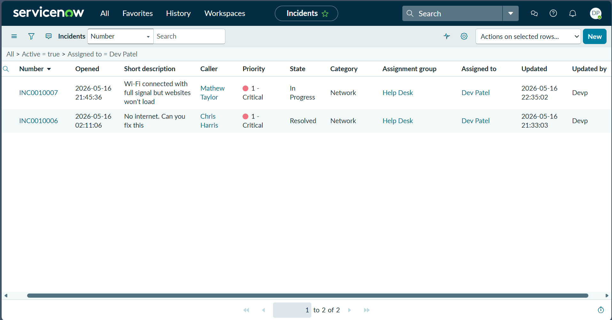  
ServiceNow incidents list showing INC0010007 In Progress - Wi-Fi connected but websites won't load

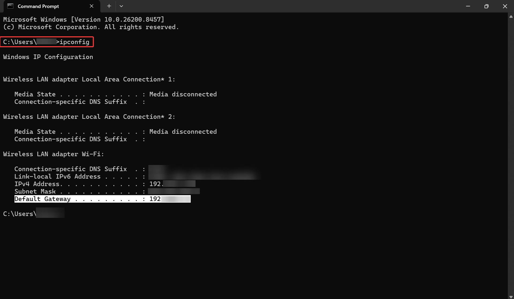  
Command Prompt - ipconfig /all output showing wireless adapter IP configuration

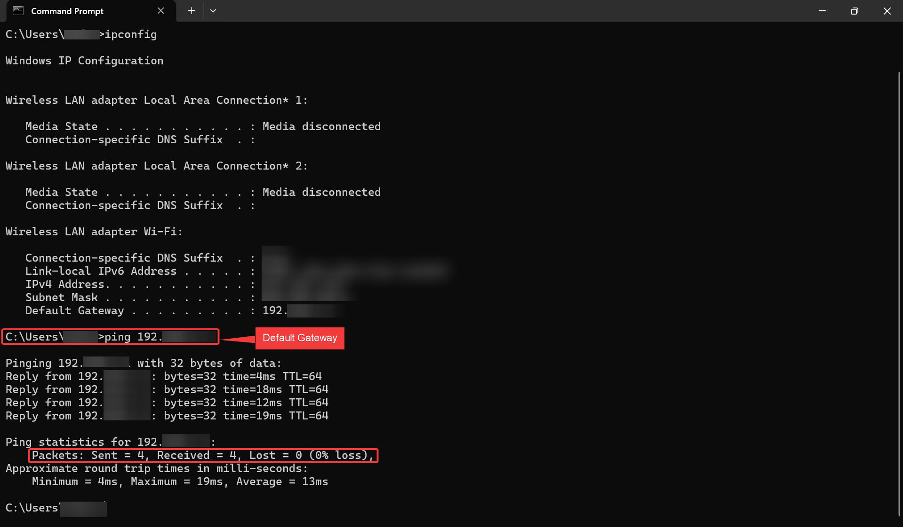  
Command Prompt - ipconfig /all continued showing disconnected adapters

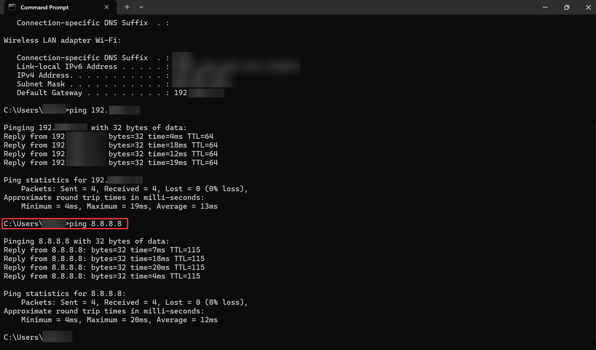  
Command Prompt - ipconfig output + ping to default gateway showing successful connectivity

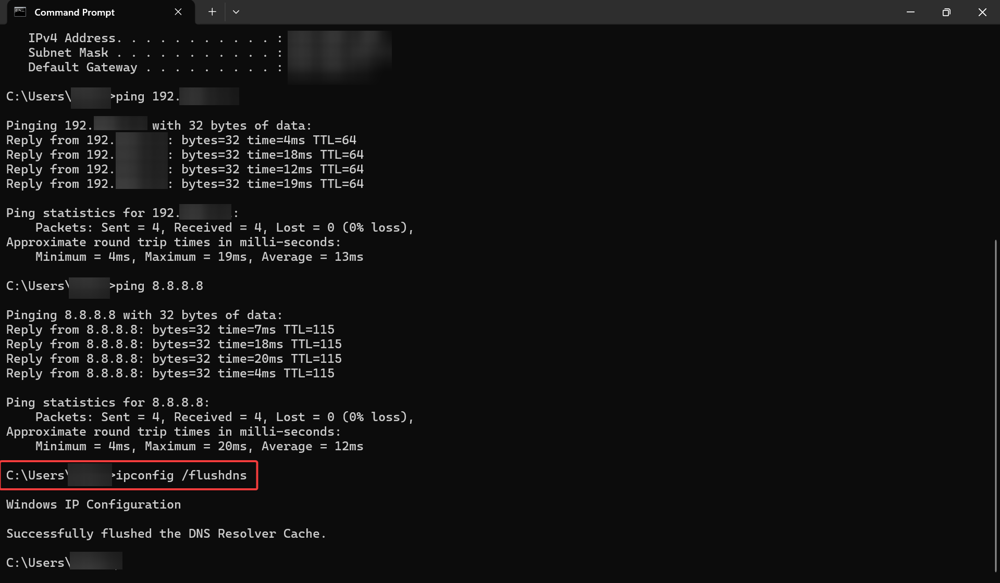  
Command Prompt - ping to default gateway showing 4 successful replies (local network functional)

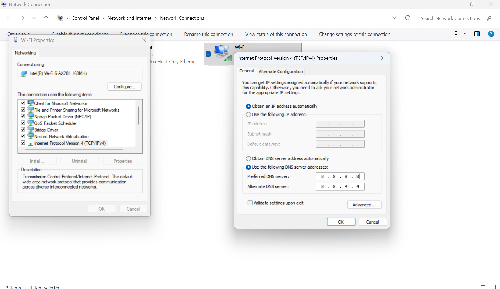  
Wi-Fi adapter properties dialog showing network adapter configuration

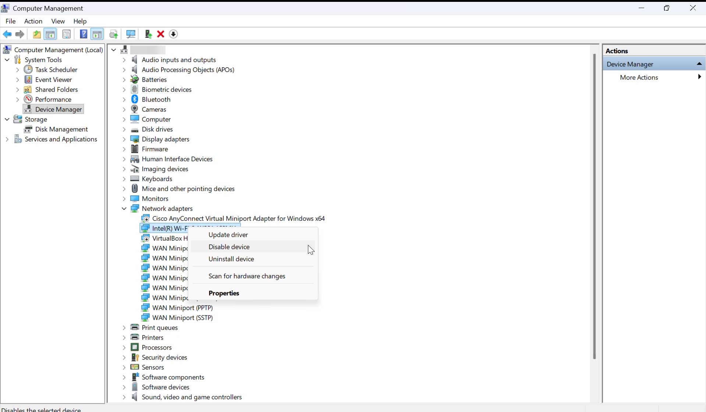  
Computer Management window opened for network troubleshooting

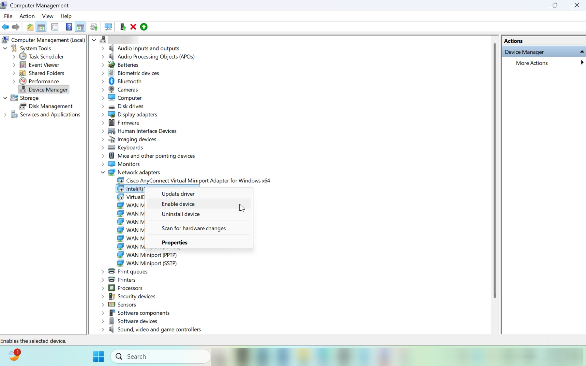  
Computer Management - navigating to Device Manager section

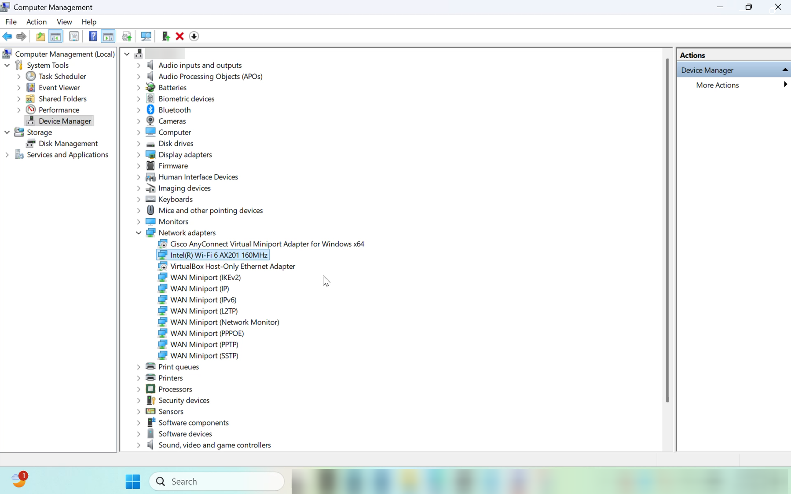  
Computer Management showing Device Manager and Storage sections

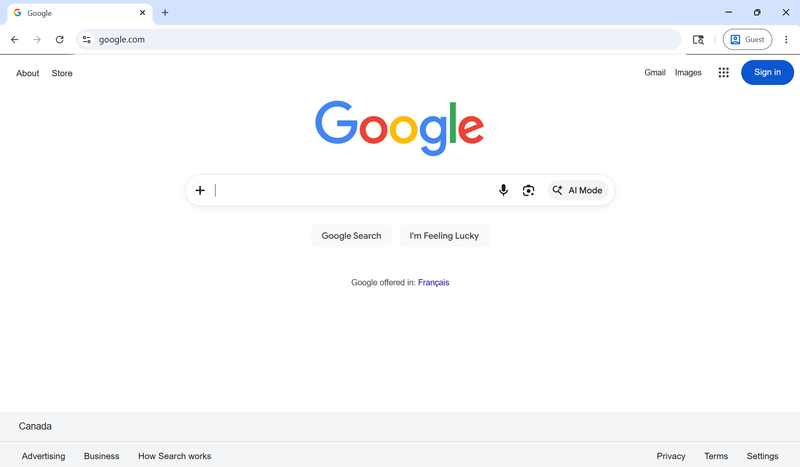  
Web browser successfully loading Google.com after DNS fix

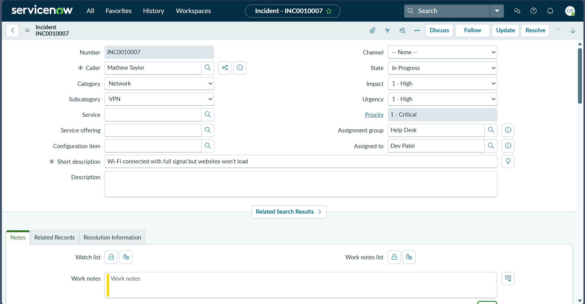  
ServiceNow incident form INC0010007 showing incident details and In Progress state

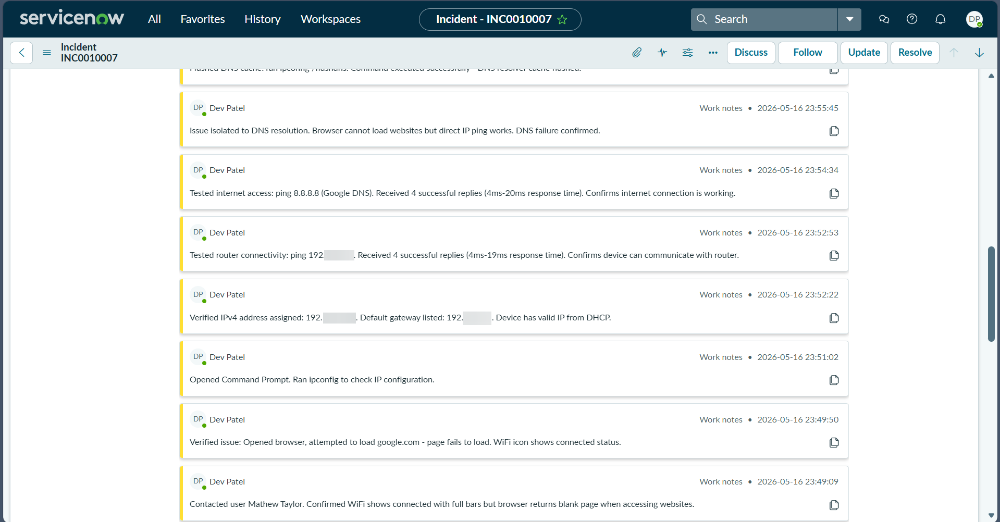  
ServiceNow Work Notes tab showing documented diagnostic steps and timestamp

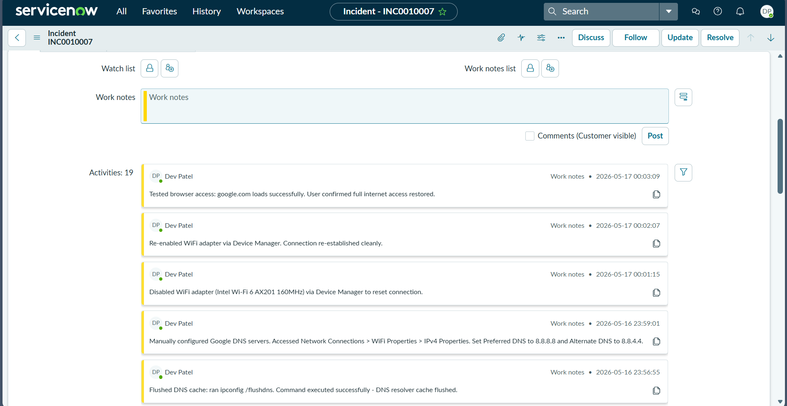  
ServiceNow Work Notes list displaying multiple troubleshooting entries

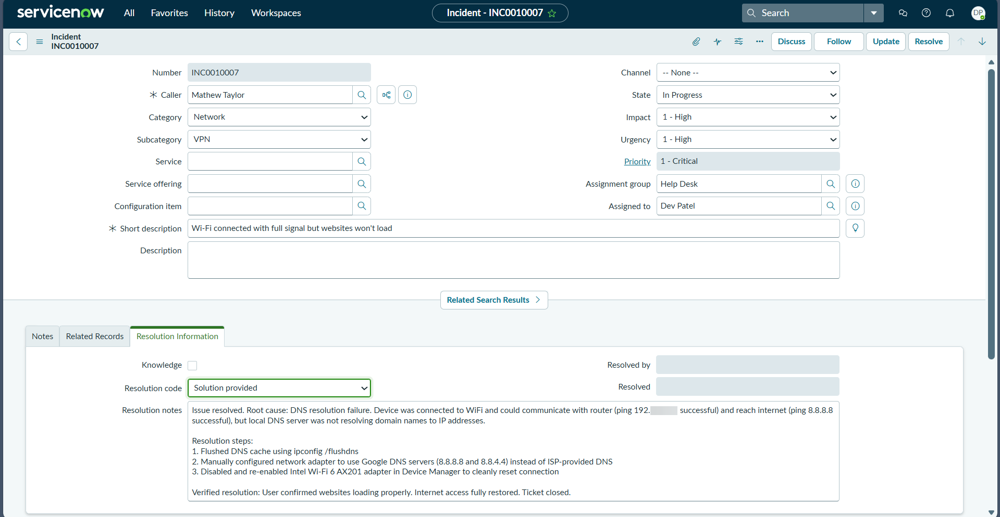  
ServiceNow incident form showing complete incident details before resolution

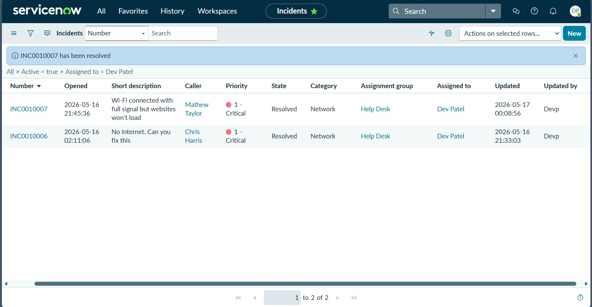  
ServiceNow incidents list confirming INC0010007 marked Resolved

## Outcome

**Time to Resolution:** 12 minutes  
**Impact:** Single user  
**Total Downtime:** 12 minutes  
**Follow-up Action:** Created KB article for DNS troubleshooting procedure

## Technical Skills Demonstrated

- DNS troubleshooting methodology
- Command-line network diagnostics (ipconfig, nslookup, ping)
- Understanding of DNS hierarchy and resolution process
- Google Public DNS configuration
- ServiceNow incident documentation
- Root cause analysis
- Sub-15-minute resolution time

## Key Insights

DNS cache corruption is a common Windows 11 issue after system updates or network changes. Always test both IP connectivity (ping 8.8.8.8) and name resolution (ping google.com) to isolate DNS vs network layer problems. Google Public DNS (8.8.8.8 / 8.8.4.4) provides reliable fallback when local DNS fails.
