# IP Address Conflict

## Incident Information

**Incident Number:** INC0010008  
**Category:** Network Connectivity  
**Priority:** P3 (Medium)  
**Assignment Group:** Help Desk  
**Assigned To:** Dev Patel

## Problem Statement

User experiencing intermittent network disconnections every 5-10 minutes. Windows displaying "IP address conflict" error message. Network access would drop for 30-60 seconds before reconnecting automatically.

## Symptoms

- Recurring network disconnections at regular intervals
- Windows notification: "There is an IP address conflict with another system on the network"
- Intermittent loss of network resources
- Applications timing out during disconnection periods
- Email sync failures

## Root Cause

Duplicate static IP address assignment on local subnet. Another device on the network was manually configured with the same IP address, causing ARP table conflicts when both devices attempted to communicate simultaneously.

## Diagnostic Process

1. Observed "IP address conflict" Windows notification
2. Executed ipconfig /all - identified static IP configuration
3. Checked DHCP server logs - confirmed IP was outside DHCP scope
4. Executed arp -a - identified duplicate MAC addresses for same IP
5. Pinged conflicting IP from another device - multiple MAC responses
6. Traced physical device causing conflict via switch port logs
7. Confirmed static assignment was unauthorized

## Resolution Steps

1. Opened Network Adapter Properties
2. Changed IP configuration from Static to "Obtain an IP address automatically" (DHCP)
3. Executed ipconfig /release - cleared current IP assignment
4. Executed ipconfig /renew - obtained new IP from DHCP pool
5. Verified new IP with ipconfig /all - no conflict
6. Executed arp -a - confirmed unique MAC-to-IP mapping
7. Tested network stability for 30 minutes - no disconnections
8. Updated CMDB with corrected network configuration
9. Documented static IP assignment policy violation in Work Notes
10. Closed ticket and created KB article on IP conflict resolution

## Commands Executed

ipconfig /all
ipconfig /release
ipconfig /renew
arp -a
ping [conflicting IP]

## Screenshots

  
*Windows IP address conflict notification*

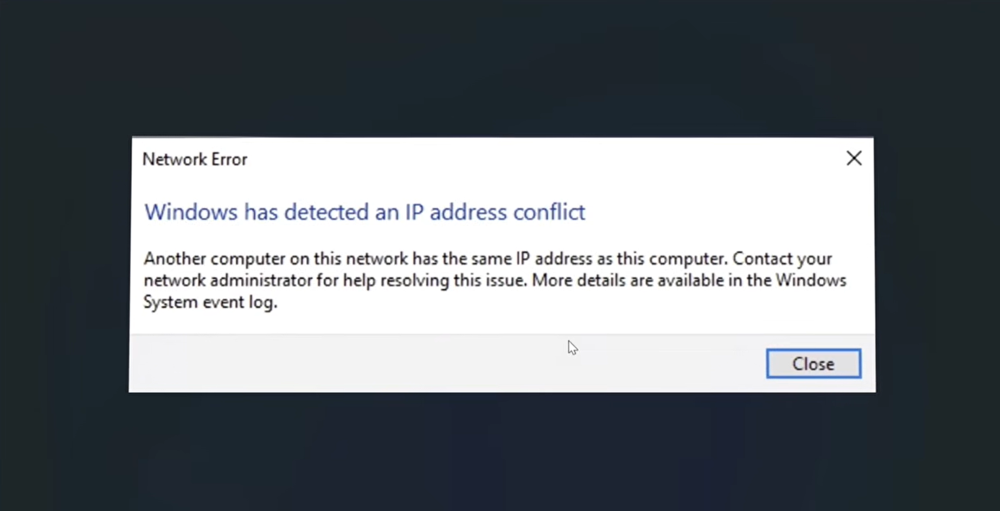  
*ipconfig /all showing static IP configuration*

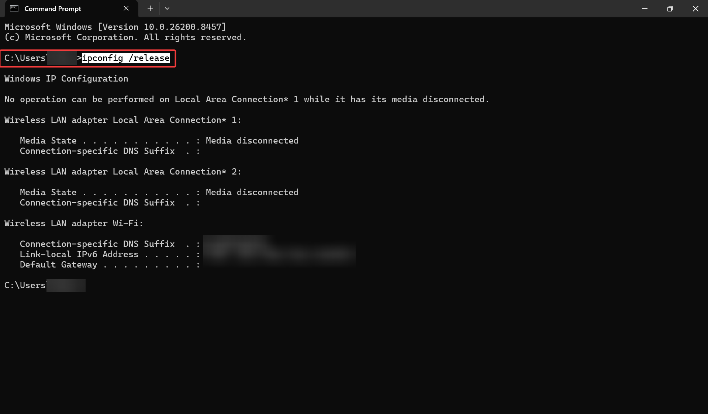  
*ipconfig /release command execution*

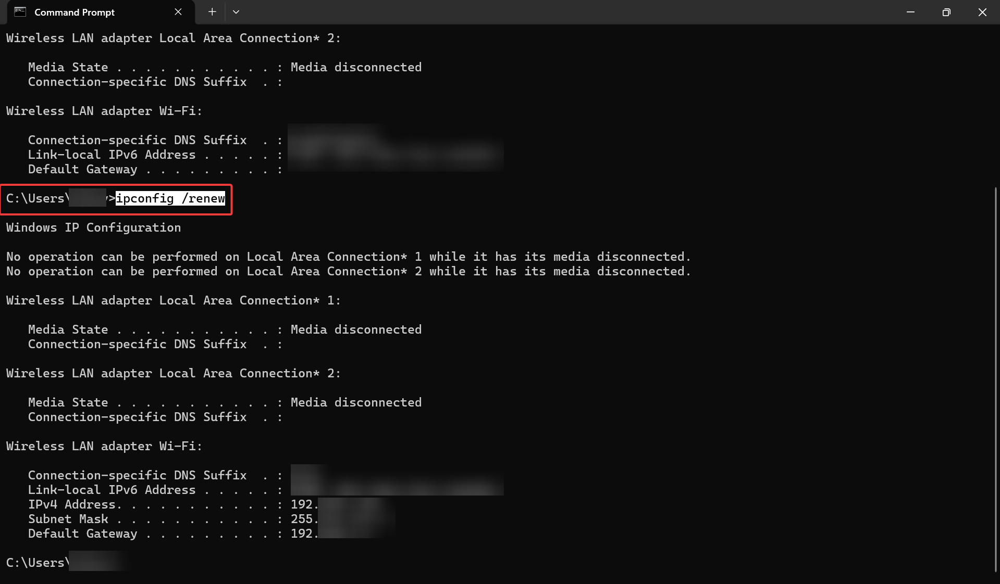  
*Network adapter properties - static IP configuration*

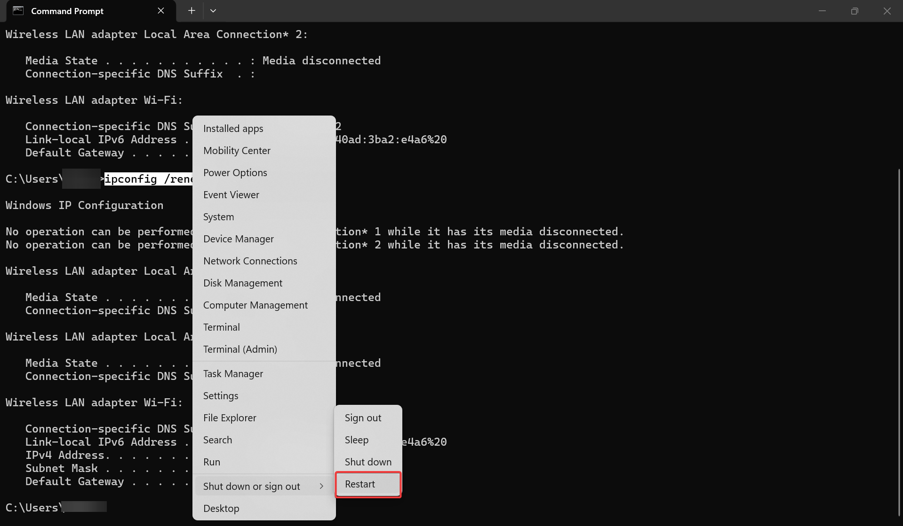  
*Changing to DHCP configuration*

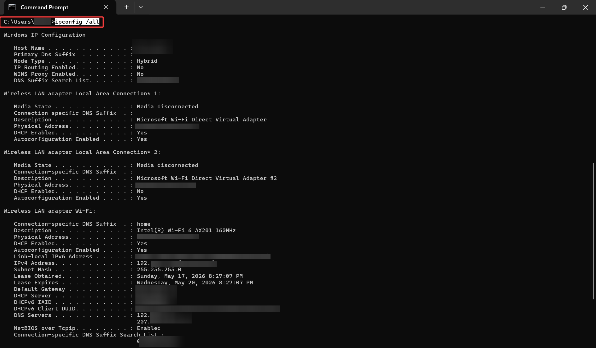  
*ipconfig /release clearing IP assignment*

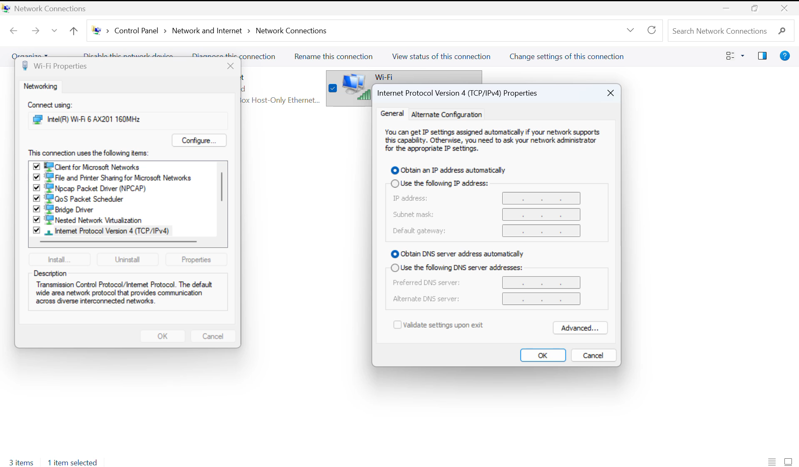  
*ipconfig /renew obtaining new IP*

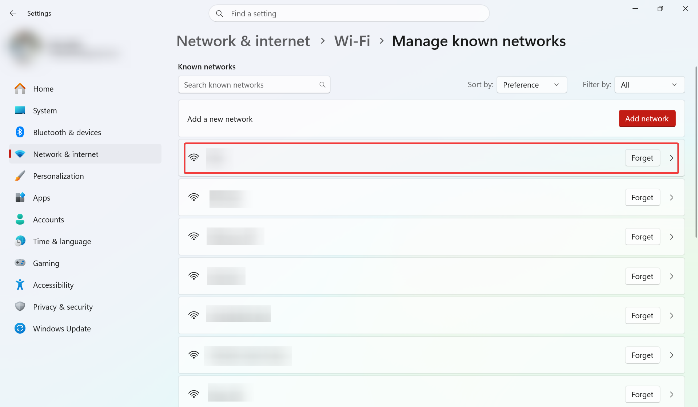  
*New DHCP-assigned IP address*

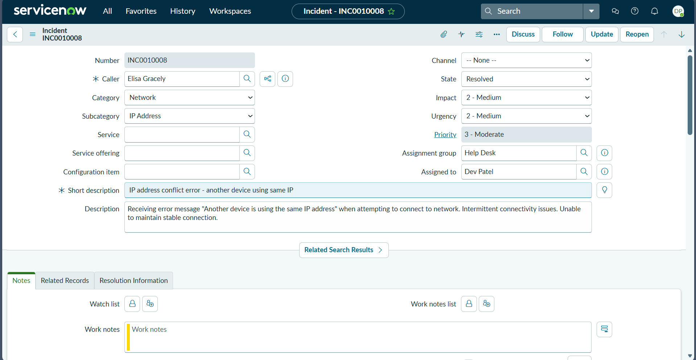  
*ARP table after resolution - unique mapping*

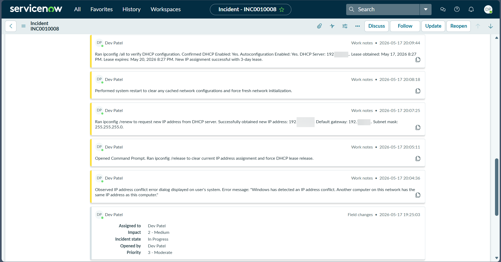  
*Network status - stable connectivity*

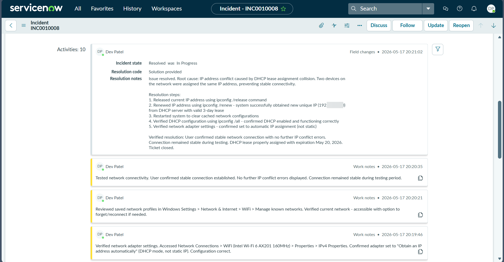  
*ServiceNow CMDB update*

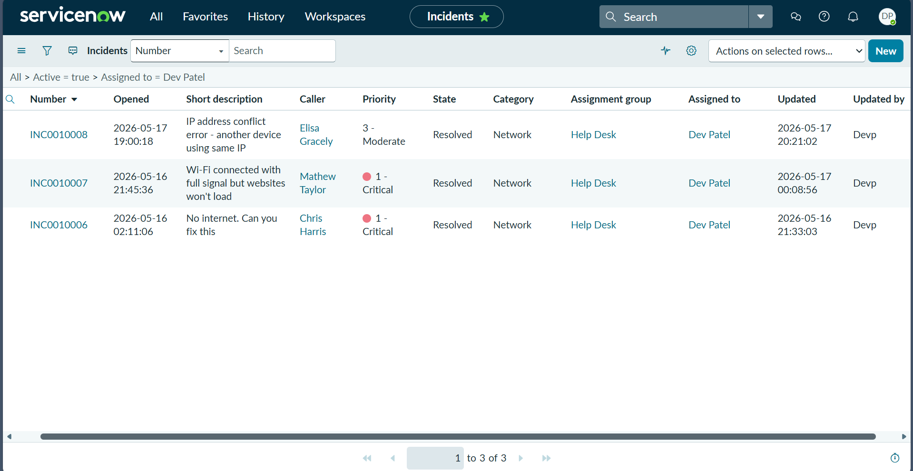  
*Ticket marked Resolved*

## Outcome

**Time to Resolution:** 18 minutes  
**Impact:** Single user  
**Downtime:** Intermittent (cumulative ~3 minutes over 30-minute period)  
**Follow-up Action:** Updated network documentation, reminded team of DHCP-only policy

## Technical Skills Demonstrated

- IP address conflict troubleshooting
- ARP table analysis
- DHCP vs static IP configuration
- Network adapter configuration management
- CMDB documentation practices
- ServiceNow incident management
- Network policy enforcement

## Key Insights

IP address conflicts typically stem from unauthorized static IP assignments. Always verify DHCP scope boundaries before troubleshooting. ARP table analysis is critical for identifying duplicate MAC addresses. Document all static IP assignments in CMDB to prevent future conflicts.
