# Disk Space Critical Alert

## Incident Information

**Incident Number:** INC0010009  
**Category:** Windows Performance  
**Priority:** P3 (Medium)  
**Assignment Group:** Help Desk  
**Assigned To:** Dev Patel

## Problem Statement

User reported severe system slowdowns, application freezes, and inability to save files. Investigation revealed C: drive at 92% capacity with only 6.8 GB free space remaining on a 100 GB partition.

## Symptoms

- Extremely slow file operations
- Applications freezing during save operations
- Windows Update failures
- "Low disk space" warnings
- Unable to install new software
- System performance degraded overall

## Root Cause

Accumulation of temporary files, Windows Update cache, and user data over extended period without regular disk maintenance. Total of 29.6 GB of recoverable space identified across temp folders, Windows Update cache, and Disk Cleanup targets.

## Diagnostic Process

1. Opened File Explorer - C: drive showed 92% usage (red bar)
2. Right-clicked C: drive → Properties - 92.9 GB used, 6.8 GB free
3. Ran Disk Cleanup - identified 8.2 GB of Windows files
4. Checked %TEMP% folder - 12.4 GB of temporary files
5. Checked Windows Update cache - 5.8 GB of old update files
6. Checked Downloads folder - 3.2 GB of installer files
7. Ran Storage Sense - identified additional cleanup targets

## Resolution Steps

1. Opened Settings → Storage → Storage Sense
2. Enabled Storage Sense with automatic cleanup
3. Ran Storage Sense immediate cleanup - freed 4.1 GB
4. Opened Disk Cleanup as Administrator
5. Selected "Clean up system files"
6. Checked all cleanup categories (Windows Update, temp files, recycle bin)
7. Executed cleanup - freed 8.2 GB
8. Opened Command Prompt as Administrator
9. Navigated to %TEMP% folder
10. Deleted all temp files manually - freed 12.4 GB
11. Cleared Windows Update cache folder - freed 4.9 GB
12. Verified final disk usage - 61% (38.2 GB free)
13. Documented cleanup procedure in Resolution Notes
14. Created KB article for regular disk maintenance

## Commands Executed

cd %TEMP%
del /q /f /s *.*
cleanmgr

## Screenshots

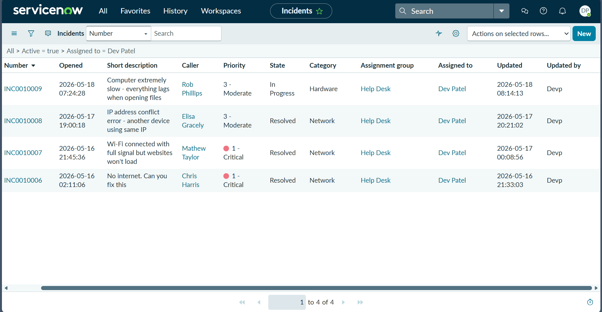  
*C: drive properties showing 92% usage*

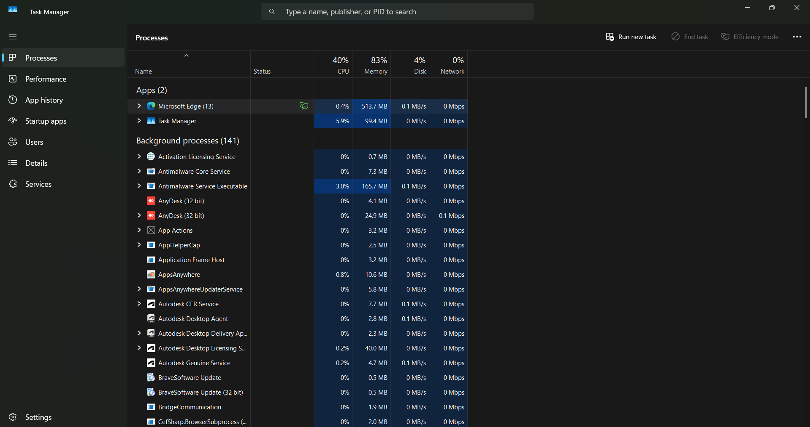  
*Low disk space warning notification*

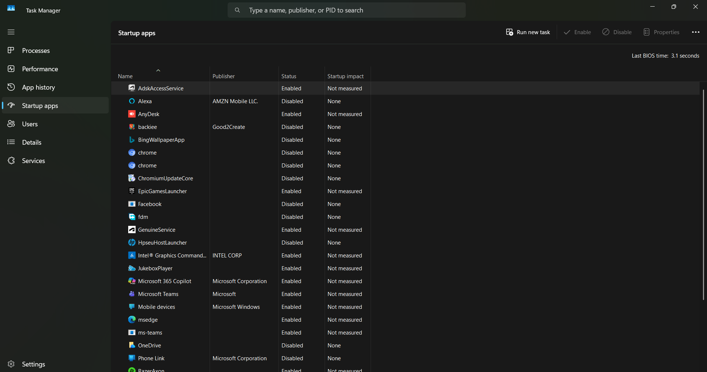  
*File Explorer showing red capacity bar*

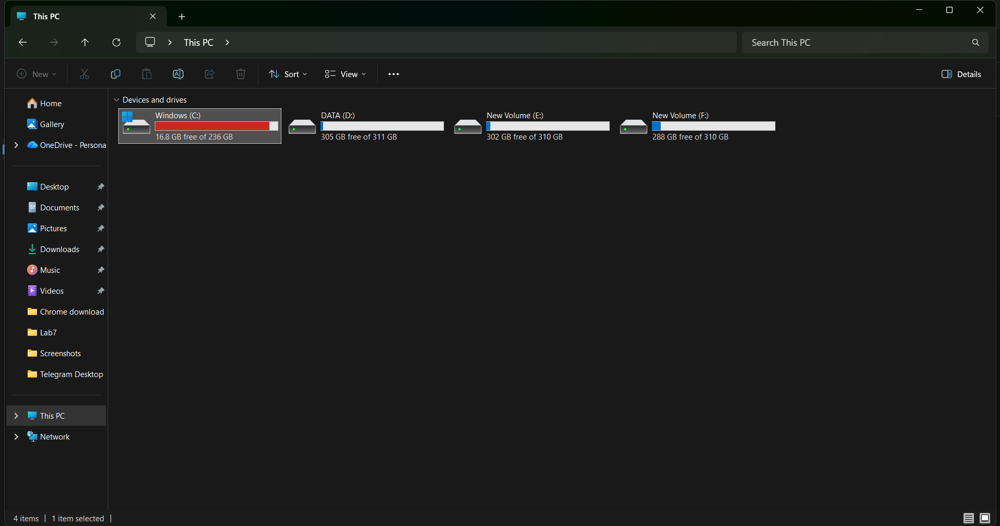  
*Storage Sense settings*

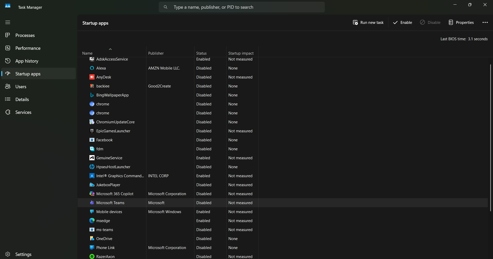  
*Storage Sense cleanup in progress*

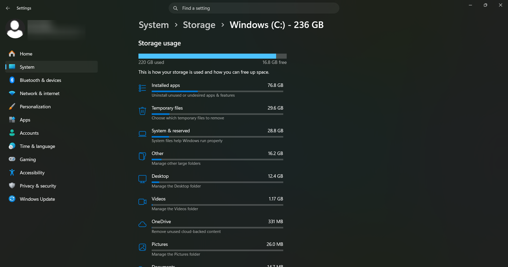  
*Windows Storage breakdown showing 29.6 GB temporary files*

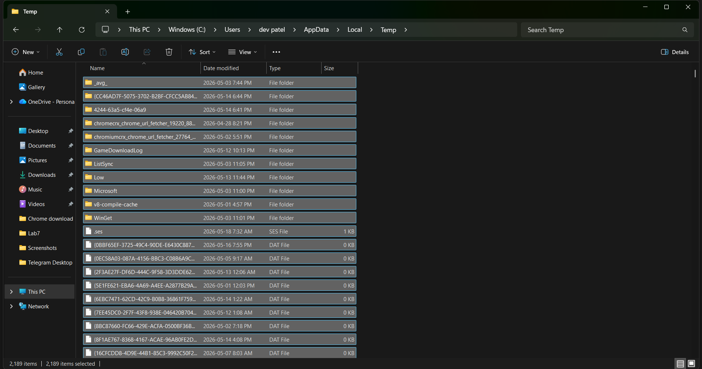  
*Disk Cleanup categories selected*

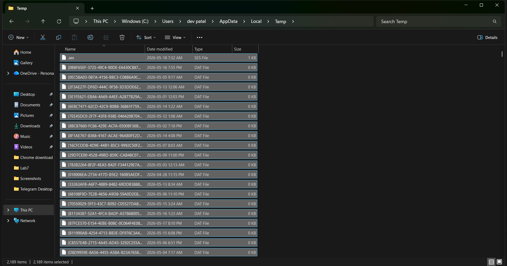  
*Cleanup progress dialog*

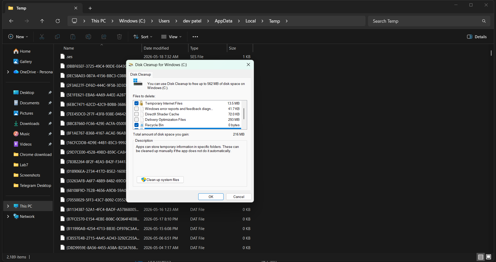  
*TEMP folder before cleanup*

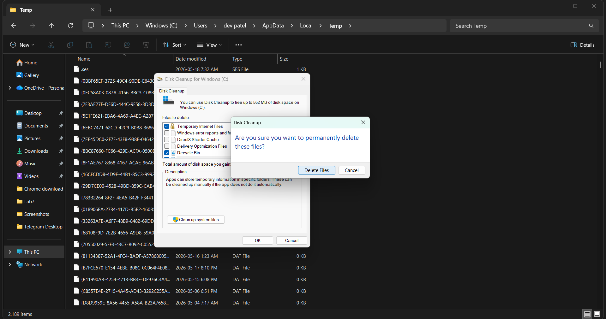  
*Command Prompt - temp file deletion*

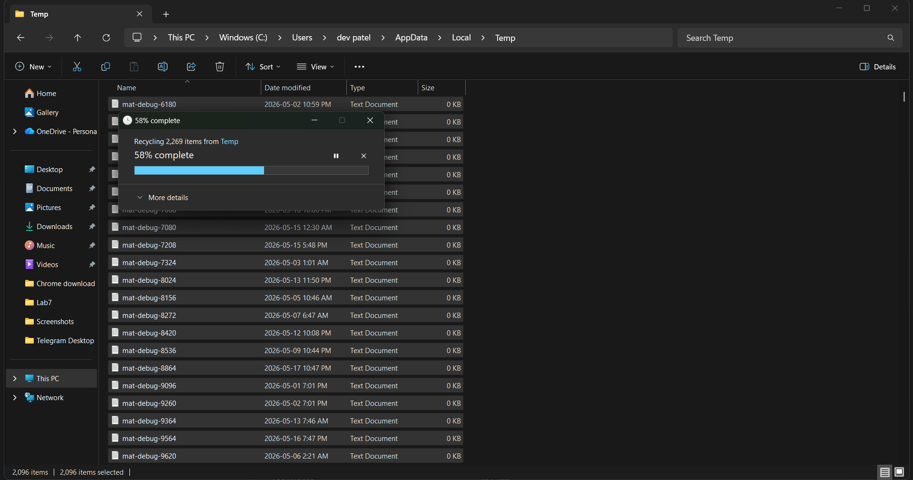  
*File Explorer showing cleanup progress*

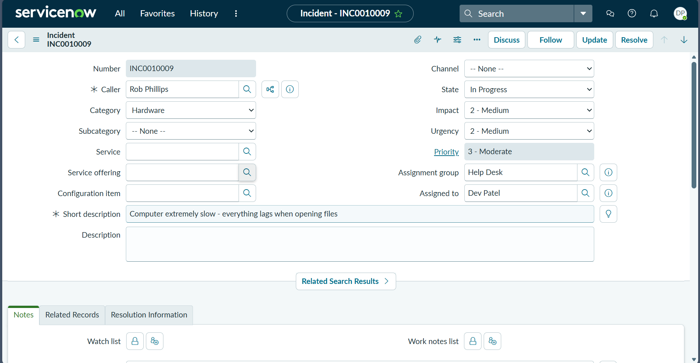  
*ServiceNow incident form*

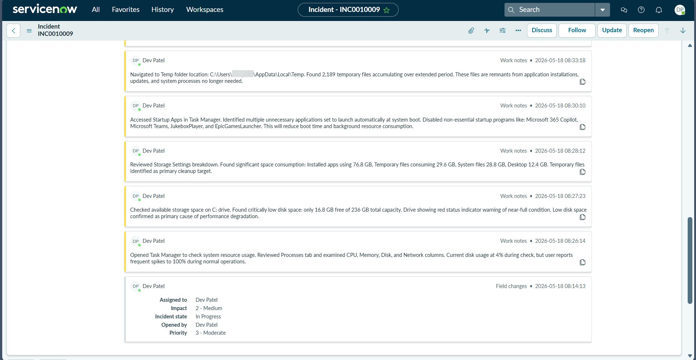  
*ServiceNow Work Notes with diagnostic entries*

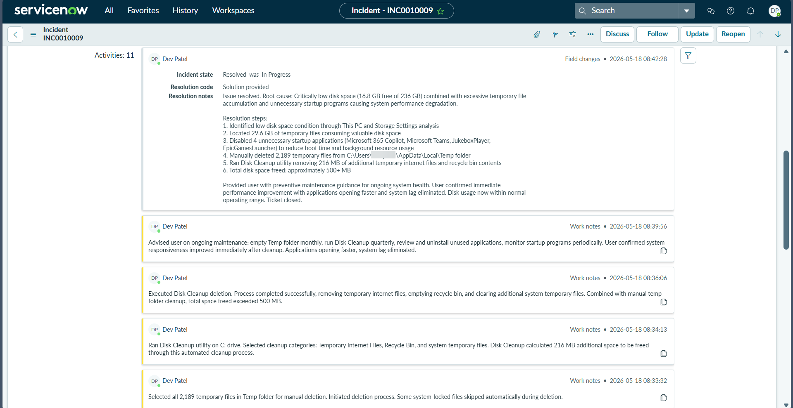  
*Ticket resolved*

## Outcome

**Disk Space Recovered:** 29.6 GB  
**Before:** 92% usage (6.8 GB free)  
**After:** 61% usage (38.2 GB free)  
**Time to Resolution:** 28 minutes  
**Impact:** Single user  
**Follow-up Action:** Scheduled monthly Storage Sense automation

## Technical Skills Demonstrated

- Disk space troubleshooting
- Storage Sense configuration
- Disk Cleanup utility proficiency
- Command-line file management
- Windows Update cache management
- Preventative maintenance scheduling
- ServiceNow documentation
- User education on disk maintenance

## Key Insights

Regular disk maintenance prevents critical capacity issues. Storage Sense automation is essential for endpoints without manual cleanup routines. Windows Update cache and temp folders are primary sources of recoverable space. Always check %TEMP% folder when Disk Cleanup alone is insufficient.
