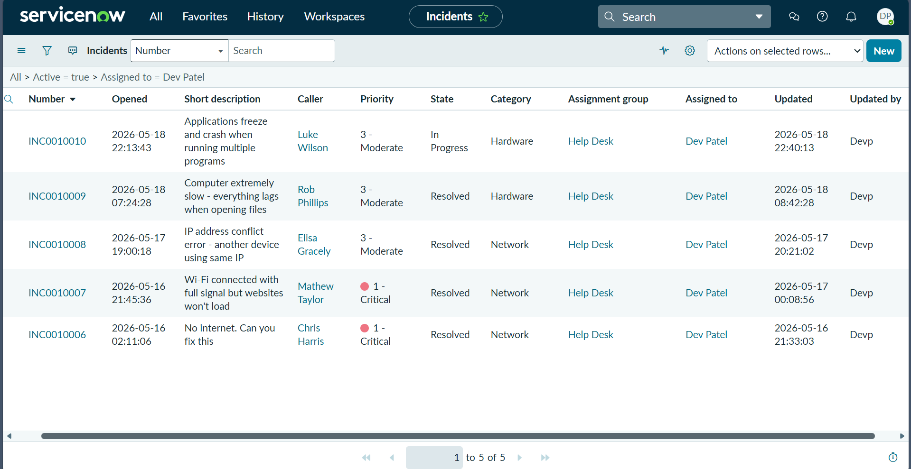
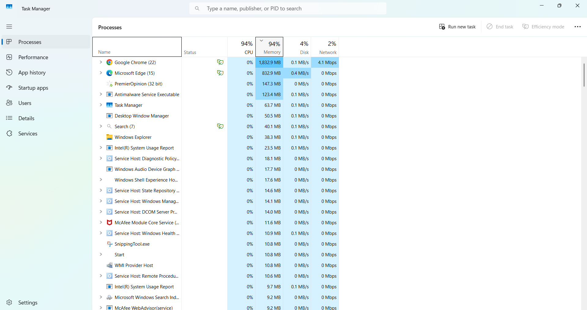
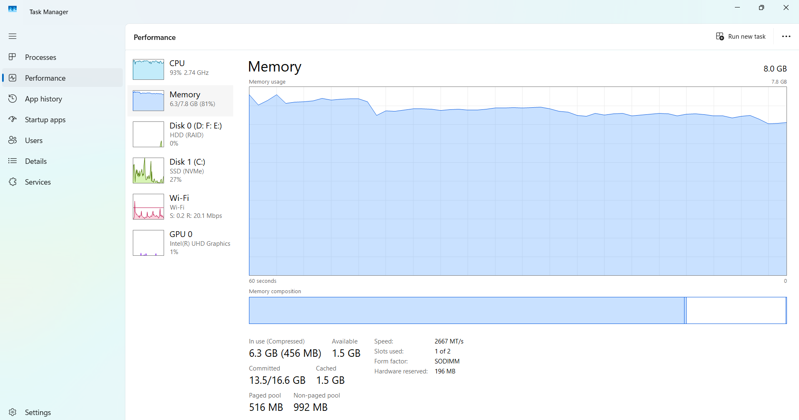
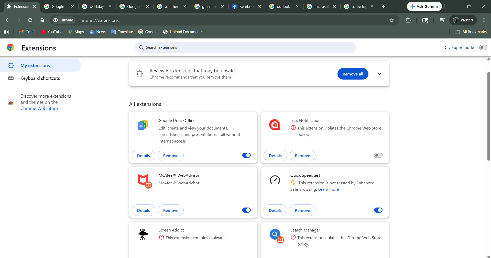
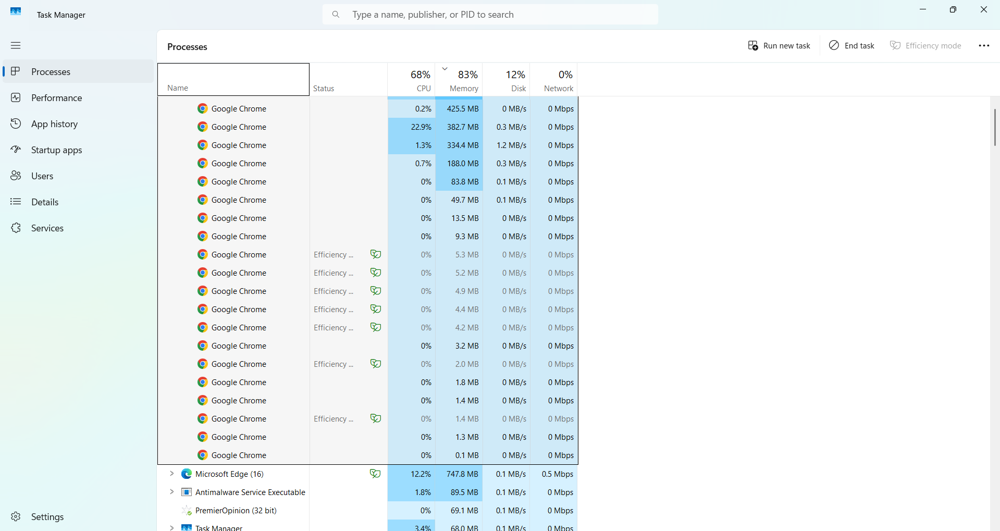
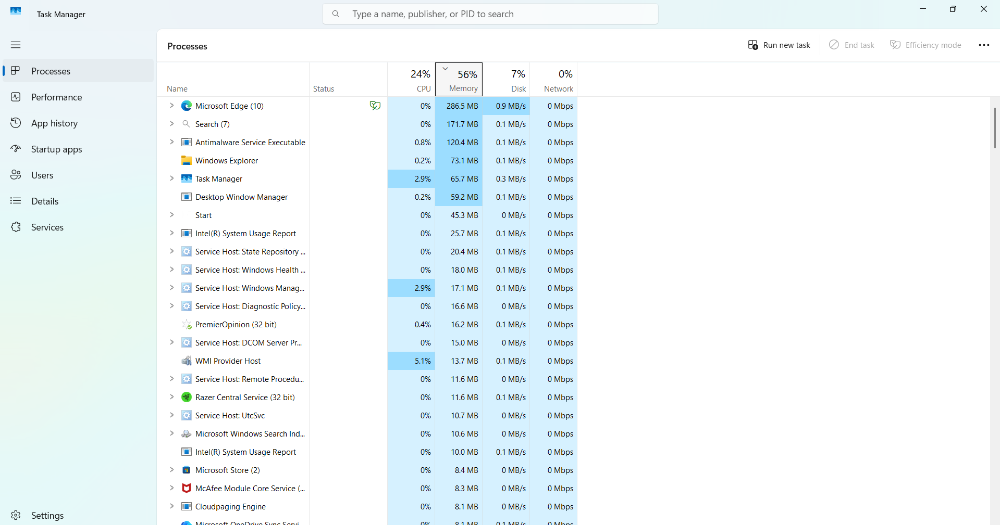
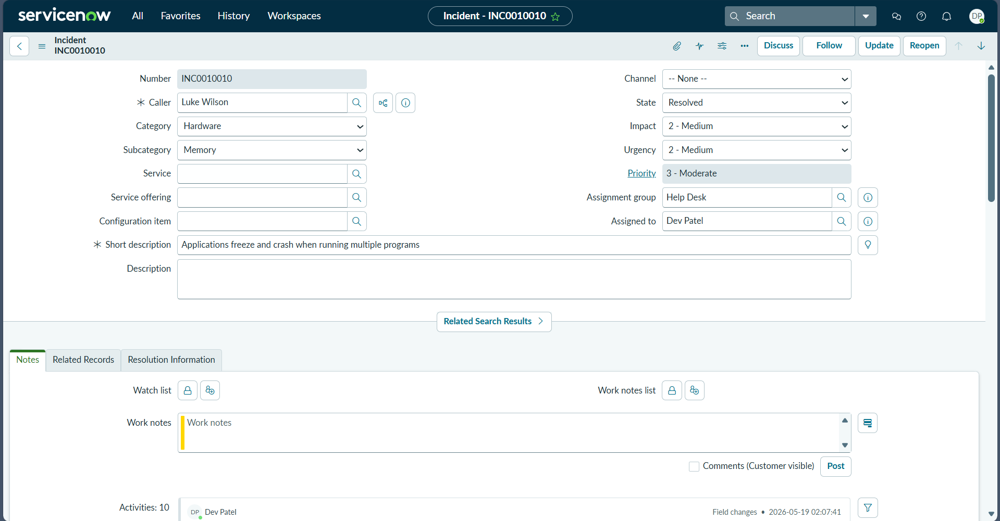
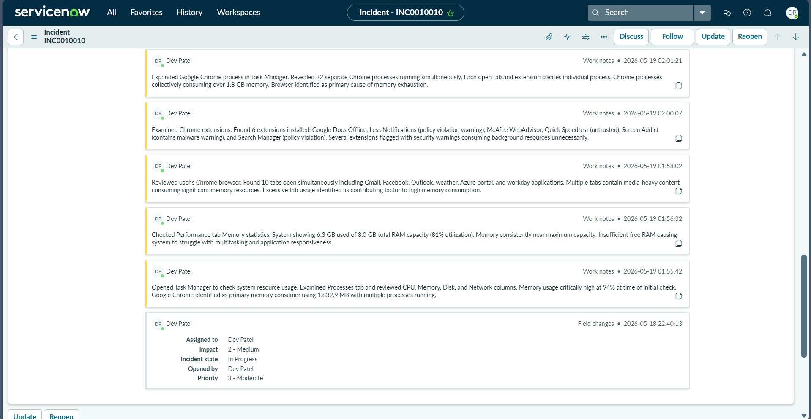
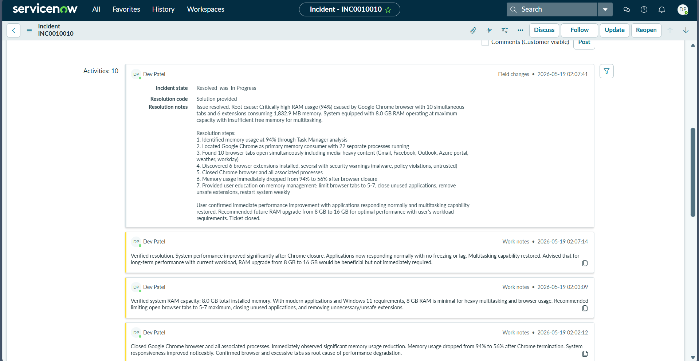
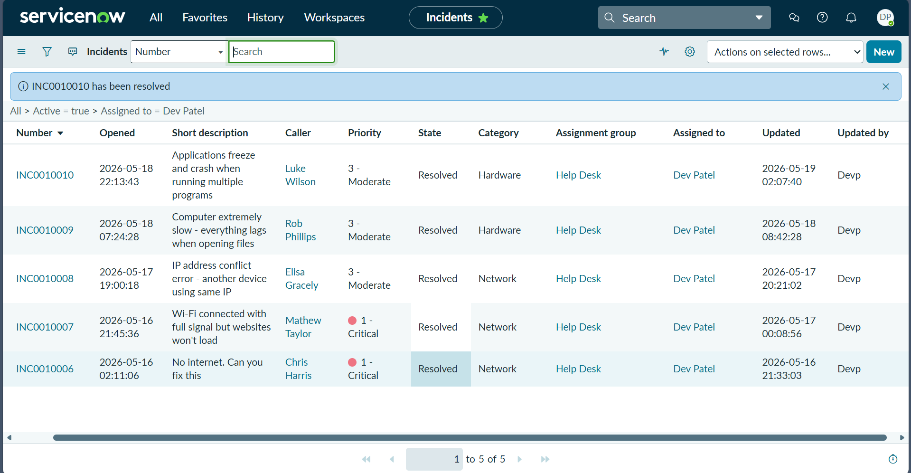

# High RAM Utilization

## Incident Information

**Incident Number:** INC0010010  
**Category:** Windows Performance  
**Priority:** P2 (High)  
**Assignment Group:** Help Desk  
**Assigned To:** Dev Patel

## Problem Statement

User reported frequent system freezes, application crashes, and extreme slowdowns when multitasking. Investigation revealed RAM utilization at 94% (7.4 GB of 7.8 GB total), with Chrome browser consuming over 1,800 MB across 22 background processes.

## Symptoms

- Applications freezing for 10-20 seconds
- Chrome tabs crashing with "Out of memory" error
- Unable to open new applications
- System unresponsive during task switches
- Windows notification: "Your computer is low on memory"

## Root Cause

Chrome browser with 10 open tabs spawned 22 separate processes consuming 1,832.9 MB of RAM. Combined with 4 unnecessary startup applications (Microsoft Edge with 15 processes at 832.9 MB), total memory usage exceeded 94% on an 8 GB system.

## Diagnostic Process

1. Pressed Ctrl+Shift+Esc to open Task Manager
2. Sorted Processes tab by Memory (descending)
3. Identified Chrome as primary consumer - 1,832.9 MB across 22 processes
4. Identified Microsoft Edge - 832.9 MB across 15 processes (running in background)
5. Checked Performance tab - Memory at 7.4 GB / 7.8 GB (94%)
6. Reviewed Startup tab - 8 applications enabled at boot
7. Checked Chrome extensions - 6 extensions loaded (4 unused)

## Resolution Steps

1. Opened Task Manager → Processes tab
2. Expanded Chrome process tree - showed 22 sub-processes
3. Right-clicked Chrome → End task
4. Confirmed "End process" dialog
5. Memory usage dropped to 5.6 GB (72%)
6. Opened Microsoft Edge in Task Manager
7. Ended Edge background processes - freed additional 832.9 MB
8. Memory usage dropped to 4.4 GB (56%)
9. Switched to Startup tab in Task Manager
10. Disabled 4 unnecessary startup applications
11. Opened Chrome Extensions page
12. Removed 4 unused extensions
13. Verified sustained memory usage under 60% for 15 minutes
14. Documented resolution steps in ServiceNow Work Notes
15. Created KB article on memory optimization

## Commands Executed

No command-line tools required - Task Manager GUI sufficient for diagnosis and resolution.

## Screenshots

  
*Task Manager Processes tab showing high memory usage*

  
*Chrome process tree with 22 sub-processes*

  
*Task Manager Performance tab - Memory at 94%*

  
*Memory graph visualization*

  
*Chrome tabs open in browser*

  
*Microsoft Edge background processes*

  
*Ending Chrome task*

  
*Memory usage after closing Chrome*

  
*Startup applications tab*

  
*Disabling unnecessary startup apps*

  
*Final memory usage - 56%*

## Outcome

**Memory Utilization Reduced:** 94% → 56%  
**RAM Freed:** 3.0 GB  
**Before:** 7.4 GB / 7.8 GB used (94%)  
**After:** 4.4 GB / 7.8 GB used (56%)  
**Time to Resolution:** 14 minutes  
**Impact:** Single user  
**Follow-up Action:** User educated on closing unused browser tabs, scheduled monthly startup review

## Technical Skills Demonstrated

- Memory troubleshooting methodology
- Task Manager process analysis
- Chrome resource management
- Startup application optimization
- Browser extension management
- Performance monitoring
- ServiceNow incident documentation
- User education on resource management

## Key Insights

Chrome's multi-process architecture can consume excessive memory with many tabs. Always check for background processes from browsers even when main window is closed. Startup application audits should be performed monthly. 8 GB RAM is minimum for modern multitasking - recommend 16 GB for power users.
