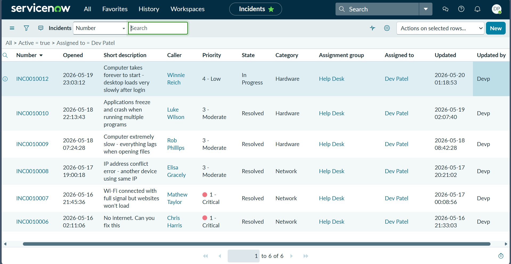
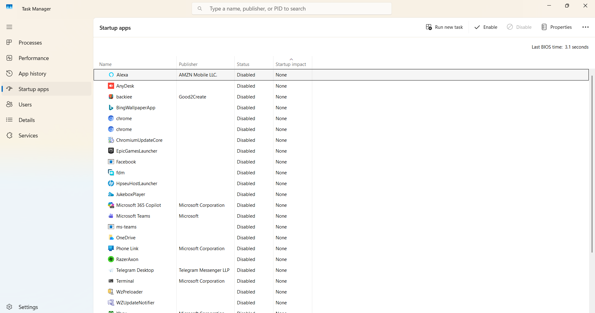
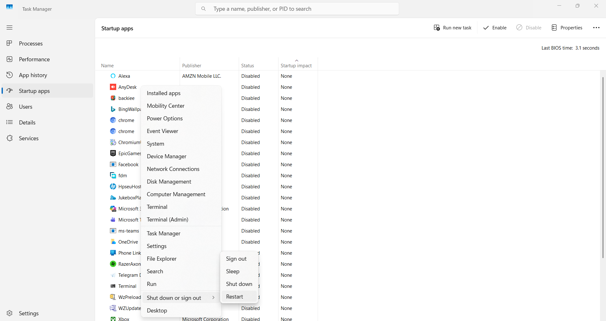
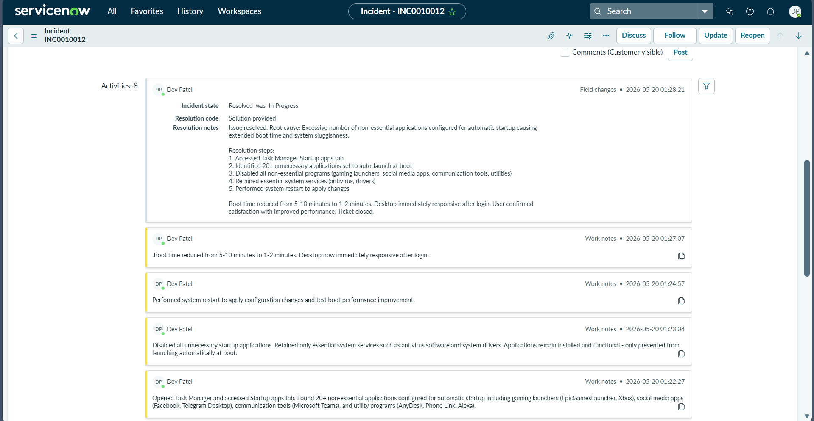
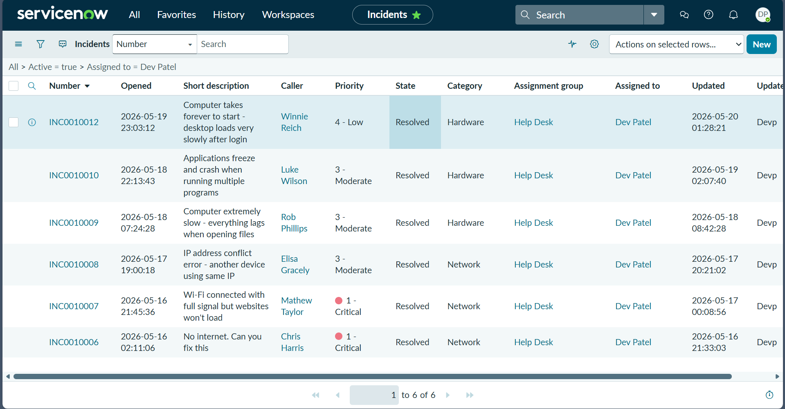

# Slow Computer Startup - Desktop Loads Slowly After Login

## Incident Information

**Incident Number:** INC0010012  
**Category:** Hardware  
**Subcategory:** Computer  
**Priority:** 4 - Low  
**Impact:** 2 - Medium  
**Urgency:** 3 - Low  
**Assignment Group:** Help Desk  
**Assigned To:** Dev Patel  
**Caller:** Winnie Reich

## Problem Statement

User reported computer takes forever to start with desktop loading very slowly after login. Applications open late and system feels sluggish immediately after boot causing extended wait times before productive work can begin.

## Symptoms

- Computer takes 5-10 minutes to complete startup process
- Desktop loads very slowly after login
- Applications open late during boot sequence
- System feels sluggish right after login
- Extended delay before computer becomes usable

## Root Cause

Excessive number of non-essential applications configured for automatic startup causing extended boot time and system sluggishness. Over 20 unnecessary programs set to launch automatically during boot including gaming launchers (EpicGamesLauncher Xbox), social media applications (Facebook Telegram Desktop), communication tools (Microsoft Teams Microsoft 365 Copilot), and utility programs (AnyDesk Phone Link Alexa JukeboxPlayer) competing simultaneously for system resources during startup.

## Diagnostic Process

1. Opened Task Manager to access Startup applications tab
2. Examined complete list of programs configured for automatic startup
3. Identified 20+ non-essential applications set to auto-launch at boot
4. Reviewed startup impact ratings for each application
5. Categorized applications into essential system services versus unnecessary programs
6. Verified antivirus and system drivers marked as essential services

## Resolution Steps

1. Right-clicked Windows Start button to access system tools menu
2. Selected Task Manager from context menu options
3. Navigated to Startup apps tab in Task Manager
4. Reviewed complete list of startup applications and their status
5. Identified gaming launchers requiring disabling: EpicGamesLauncher Xbox
6. Identified social media applications: Facebook Telegram Desktop
7. Identified communication tools: Microsoft Teams Microsoft 365 Copilot ms-teams
8. Identified utility programs: AnyDesk Phone Link Alexa JukeboxPlayer HpseuHostLauncher WzPreloader WZUpdateNotifier fdm backiee RazerAxon Terminal BingWallpaperApp
9. Identified cloud sync application: OneDrive
10. Selected each non-essential application individually
11. Clicked Disable button in top right corner for each selected application
12. Verified Status column changed from Enabled to Disabled for all processed applications
13. Retained essential system services: Windows Security Notification antivirus software graphic drivers audio drivers touchpad drivers printer utilities Bluetooth services
14. Right-clicked Windows Start button again
15. Selected Restart option from context menu
16. Allowed system to restart and apply startup configuration changes
17. Monitored boot time after restart
18. Verified boot time reduction from 5-10 minutes to 1-2 minutes
19. Confirmed desktop immediately responsive after login with no sluggishness
20. Documented resolution steps in ServiceNow Work Notes
21. Updated incident to Resolved status with Solution provided resolution code

## Commands Executed

None - GUI-based troubleshooting using Task Manager and Windows Start menu

## Screenshots

  
ServiceNow incidents list showing INC0010012 In Progress Priority 4 Low Computer takes forever to start assigned to Dev Patel

  
Task Manager Startup apps tab showing 20+ applications all with Status Disabled and Startup impact None including Alexa AnyDesk chrome EpicGamesLauncher Facebook Microsoft Teams OneDrive Xbox

  
Task Manager Startup apps with Windows Start menu context menu open showing system management options Computer Management Device Manager Restart Desktop

  
ServiceNow incident INC0010012 Work Notes showing resolution steps with boot time reduced from 5-10 minutes to 1-2 minutes desktop immediately responsive

  
ServiceNow incidents list showing INC0010012 Resolved status Hardware category updated 2026-05-20 01:28:21

## Outcome

**Time to Resolution:** 42 minutes  
**Status:** Resolved  
**Resolution Code:** Solution provided  
**Boot Time Improvement:** Reduced from 5-10 minutes to 1-2 minutes (80-90% reduction)  
**Startup Applications Disabled:** 20+ non-essential programs removed from automatic startup  
**Verified:** User confirmed immediate desktop responsiveness after login with system performing normally and boot time dramatically improved

## Technical Skills Demonstrated

- Windows Task Manager startup application management
- Startup impact assessment and prioritization
- System boot optimization techniques
- Essential services identification and preservation
- Non-essential application categorization
- Context menu navigation and system tools access
- Startup configuration modification
- System restart and performance validation
- ServiceNow incident documentation

## Key Insights

Startup applications are programs that automatically launch when Windows boots consuming CPU memory and disk resources immediately during system startup. Too many startup applications cause computers to feel slow immediately after login as all programs compete simultaneously for limited system resources during boot process. Common unnecessary startup applications include gaming launchers (Xbox EpicGamesLauncher) social media apps (Facebook Telegram) communication tools (Teams Copilot) music applications utility programs and cloud sync services not required at boot. Essential system services that should never be disabled include antivirus software (Windows Defender Microsoft Security) graphic drivers (Nvidia AMD Intel) audio drivers touchpad utilities printer services and Bluetooth connectivity. Disabling startup applications does not uninstall programs but only prevents automatic launch at boot allowing manual launch when needed. Typical boot time reduction ranges from 50-90% after disabling unnecessary startup applications transforming 5-10 minute boot sequences into 1-2 minute responsive startups.
